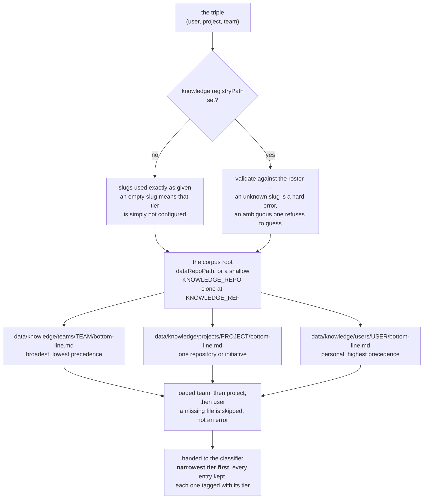

# Knowledge: the BDI files supervision reads

A coding agent does not inherit your team's practices. Those live in senior developers' heads and
half-remembered PR reviews, and every new session starts without them:

- the agent pushes straight to `main` — *your rule: always via a reviewed PR*
- the agent force-pushes a shared branch — *your rule: ask first*
- the agent writes `bypass-permissions` into shared config — *your rule: personal config only*
- the agent pastes a live API key into a prompt — *your rule: reference it by env-var name*

Knowledge files are where those rules live so the supervisor can apply them.

---

## Three tiers, narrower wins



Loading order and presentation order are deliberately opposite: the files load broad to narrow, and
are handed to the classifier narrow first so it sees the precedence. Modeled after how Claude Code
layers `CLAUDE.md` files.

Conflicts are not resolved during loading. Every entry from every tier is surfaced, annotated
with its tier, and the classifier reasons about them. That is deliberate: a team-level red safety
rule must never be silently dropped because a narrower file happens to reuse an id.

A missing tier file is **not** an error. It is skipped, and supervision runs on what is there —
including on nothing at all, which simply means no BDI informs the decision.

Start from [`../knowledge/bottom-line.template.md`](../knowledge/bottom-line.template.md).

---

## The team tier, and the second machine it needs

The miner (`session-sitter learn`) proposes user- and project-tier clauses from one machine's decision
trail. It cannot propose a **team** clause from that alone, and the reason is structural rather than a
threshold set too high: a decision record has no user field, and one data directory is one machine and
one person, so *"two developers independently do this"* is not a measurable proposition from a single
laptop at any number.

The team tier is the tier that binds people who did not write it, so it is also the one where a learned
proposal is most useful. What makes it measurable is an **opt-in per-host aggregate**:

```bash
session-sitter learn --publish       # writes <corpus>/data/aggregates/<host>.json
git -C <corpus> add data/aggregates/ && git -C <corpus> commit -m 'aggregates: ...'
```

**What is in that file:** a shape hash and three counts per shape, and nothing else. No command line,
no working directory, no session name, no prose anyone typed. It carries only shapes that cleared the
user row on that machine, and `host` is a per-machine pseudonym unless you pass `--allow-host-names`.
`session-sitter learn --publish` writes the file and stops — it runs no git and sends nothing anywhere;
you review the diff and commit it, in a PR your team sees.

**How the merge counts.** Per-host counts are **cleared, never summed.** Each contributing host must
independently clear the whole user row (≥3 occurrences, ≥3 sessions, ≥2 days) before it counts as a
witness at all — 11 occurrences on your laptop plus 1 on somebody else's is your habit with a witness,
not a team practice. On top of that, the proposing machine must clear the team row on its own counts
(≥12 occurrences, ≥8 sessions, ≥14 days, ≥90 % confined to one working directory) and at least two
hosts must have cleared the user row. Until a second developer opts in, the run line records
`declinedPromotions: [{to: "team", why: …}]` so the ceiling is visible in the artifact.

**What it can and cannot produce.** A team clause proposed this way is `status: proposed`, exactly like
every other proposal: it cannot decide, cannot be matched, and does not render into a prompt until a
human accepts it in a PR. One host publishes one file, named for that host, and
[`../ci/check-aggregates.sh`](../ci/check-aggregates.sh) — install it as your corpus repo's CI step or
pre-commit hook — checks that a file agrees with its own filename and that one commit touches one
aggregate. That buys accident prevention and an audit trail, **not authentication**: anyone with push
access can commit a file naming any host. What holds is the review gate, which no aggregate can move.

A machine with no push access to the corpus cannot publish, and that is the honest cost of putting the
evidence in the repo that is already under review rather than inventing a transport for it.

---

## The BDI model

Each file holds entries of three kinds:

- **Belief** — a fact about how things are. *"Pushes to main go through a reviewed PR."*
- **Desire** — a goal or preference. *"Keep the test suite under two minutes."*
- **Intention** — a rule shaped `when X → do Y`, with a trigger, a precondition, an action and a
  termination condition. *"When the agent proposes a force-push to a shared branch, ask first."*

### The entry format

A `###` heading naming the kind and the title, then a metadata table, then the body:

```markdown
### Belief: Pushes to main go through a reviewed PR

| Field | Value |
|---|---|
| id | team-git-001 |
| level | orange |
| confidence | high |
| scope | team |
| source | 2026-06 PR review thread |
| tags | git, review |
| added | 2026-06-14 |

The team merges through pull requests; a direct push to main bypasses review and CI gating.

---
```

| Field | Meaning |
|---|---|
| `id` | stable identifier. The classifier cites it, so decisions are traceable to a rule. |
| `level` | 🟢 `green` / 🟡 `yellow` / 🟠 `orange` / 🔴 `red` — the entry's **default** light. |
| `confidence` | `low` / `medium` / `high`. Repetition across sessions is what firms this up. |
| `scope` | the tier this entry belongs to: `user`, `project` or `team`. |
| `source` | where it came from — a session, a PR thread, a person. Provenance matters. |
| `tags` | comma-separated, for grouping. |
| `added` / `updated` | ISO dates. Recency is weighed. |
| `supersedes` | the id this entry replaces, when a practice changed. |
| `expires` | ISO date after which it should not be trusted. |

`level` is a **default, not a verdict**. The classifier weighs scope, confidence, recency,
provenance and the actual situation. An explicit instruction in the current session outranks
older inferred knowledge — unless a mandatory safety or policy constraint (`red`) applies.

Entries end at the next `###` heading, a `##` section boundary, or a lone `---`. Anything outside
an entry is ignored, so prose and front-matter are free.

---

## Routing: which files apply to this session

Supervision needs one `(user, project, team)` triple. There are two ways to get it.

### Settings-driven (the default)

```jsonc
"sessionSitter.knowledge.user": "your-slug",
"sessionSitter.knowledge.project": "your-project",
"sessionSitter.knowledge.team": "your-team"
```

The three slugs are used as given. A slug you leave empty means that tier is simply not
configured: its file is reported missing and the other tiers still load. Nothing is guessed, and
no wrong slug is ever substituted.

### Registry-driven (optional)

Point `sessionSitter.knowledge.registryPath` at a markdown file with the roster, and the triple is
validated against it:

- **project omitted** and the user is on exactly one project → that project is used.
- **project omitted** and the user is on several → a hard error. It refuses to guess.
- **team omitted** → taken from the user's row, else the project's row.
- **an unknown slug anywhere** → a hard error. Never a default.

The registry is three markdown tables; see
[`../knowledge/REGISTRY.example.md`](../knowledge/REGISTRY.example.md). Column headers are matched
by name (`Team slug`, `Project slug`, `User slug`), and cells may be plain, backticked, or
markdown links.

Use a registry when several people share a corpus and you want a typo in a slug to fail loudly
rather than silently route to a file that does not exist.

---

## Where the files are read from

In precedence order:

1. `sessionSitter.dataRepoPath` — a local checkout. Offline, instant, and it picks up uncommitted edits.
2. `KNOWLEDGE_REPO` (git URL) + `KNOWLEDGE_REF` — shallow-cloned per load, so what is read is
   what is committed.

Reading a local checkout is the recommended setup: the loading path stays deterministic and needs
no network.

**There is no fallback to the workspace.** With neither configured, supervision classifies without
BDI and says so in the log. That is deliberate: the workspace is the one tree the supervised agent
can write, so defaulting policy to it would let an agent author the clauses that govern its own
next tool call — at the user tier, which outranks the team's. Knowledge is only ever read from a
source you named, for the same reason a wrong slug is never substituted for a missing one.

---

## Loading knowledge yourself

The same loader is exposed as a CLI, so a skill or a script can fetch the three tier files:

```bash
node out/corpus/cli.js fetch-knowledge \
  --user alice --project demo-project --team platform \
  --local /path/to/corpus
```

It prints the load order and, per tier, the slug, the in-repo path, whether it exists, and its
content. A missing file is `exists: false`, never an error. That contract is what
[`../skills/kb-sitter/SKILL.md`](../skills/kb-sitter/SKILL.md) is built on.

---

## Writing good entries

- **Be specific enough to act on.** "Be careful with git" cannot drive a decision; "force-pushing
  a shared branch needs a heads-up first" can.
- **Say why, and where it came from.** The classifier cites the entry in the notification you
  read on your phone. Without a reason it is unreviewable.
- **Set `level` to what you would actually want.** A `red` on everything trains you to ignore it.
- **Supersede rather than delete.** `supersedes` keeps the history of why a practice changed.
- **Put personal preference in the user tier.** Team files are for what the team agreed.

### A path matcher is a textual guard, not a filesystem one

This applies to a `Match:` you write by hand and to one `session-sitter learn` proposes for a
directory, and it is the single thing most easily misread about either.

A matcher is a regular expression over the tool name and its arguments as JSON. When it names a
directory it matches **the path string the tool was asked to write** — never the file that string
resolves to. Three consequences, all of which have bitten someone:

- **A symlink defeats it.** If `infra/prod` is, or contains, a symlink pointing out of the repository,
  a write "under `infra/prod/`" lands outside it and the matcher is satisfied either way. The miner
  refuses to propose a directory clause when any path in its own evidence resolved somewhere other
  than where it was written, but a symlink created afterwards is invisible to the clause.
- **The written form has to match.** `Write` may be asked with an absolute path or one relative to the
  session's working directory, and a matcher anchored on the absolute form does not match the relative
  one. That direction is safe — the call falls through to the classifier instead of being decided for
  free — but it means a green path clause is a latency optimisation, never a guarantee of coverage.
- **It is not `assertWritable`.** `assertWritable` in `src/supervisor/learnedClauses.ts` is the only
  filesystem boundary in this system: it resolves symlinks, and it is what stops the pipeline writing
  outside the corpus. No clause, learned or hand-written, substitutes for it. Do not treat "there is a
  red clause about `infra/prod`" as containment.

Write path clauses anyway — they are the cheapest way to state where work belongs. Just do not read
one as a wall.

---

## See also

- [`SUPERVISION.md`](SUPERVISION.md) — how a light becomes an action
- [`CORPUS.md`](CORPUS.md) — feeding sessions in, which is where entries come from
- [`CONFIGURATION.md`](CONFIGURATION.md) — every knowledge setting
